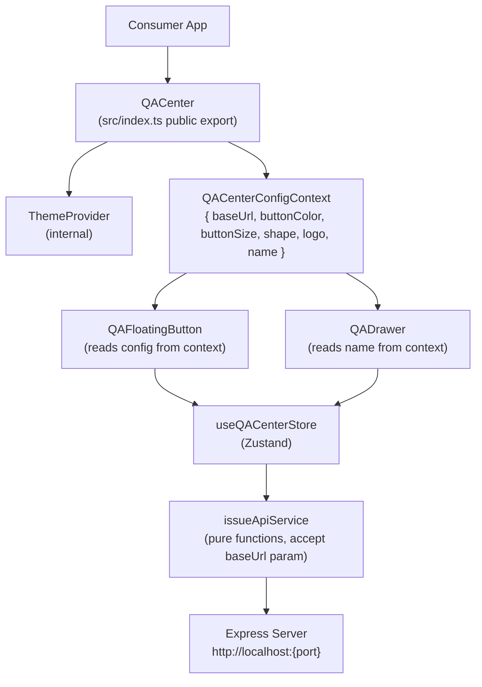

# Design Document: QACenter Component API

## Overview

This feature refactors QA Center from a hardwired standalone app into a properly exported React component (`<QACenter />`). The component wraps the existing `QAFloatingButton` and `QADrawer` into a single composable unit with a typed props API, allowing any React project to embed QA Center by importing one symbol from `@purr/qa-center`.

The key design challenge is threading configuration props (button appearance, API base URL) down to the components and services that need them — without introducing global state mutations, without leaking internal symbols into the public API, and without breaking the existing CLI standalone mode.

### Key Design Decisions

**Config via React context, not module-level state.** The resolved API base URL must be available to `issueApiService` calls that originate deep in the Zustand store. Rather than storing the URL in a module-level variable (which would be a global side effect and break multi-instance scenarios), a `QACenterConfigContext` is introduced. The store is refactored to accept a `baseUrl` parameter on each API call, reading it from the context at the call site.

**Inline styles only — no CSS files.** All existing components already use inline styles exclusively. This design preserves that approach and explicitly prohibits importing `.css` files from the package, satisfying the CSS isolation requirement with zero additional tooling.

**Single `src/index.ts` entry point with explicit named exports.** No wildcard re-exports. The public API surface is exactly `{ QACenter, QACenterProps, QACenterButtonColor, QACenterShape }`.

**`apiBaseUrl` wins over `port`; both fall back to `http://localhost:3333`.** URL resolution is a pure function of the two props, computed once inside `QACenter` and placed into context.

---

## Architecture



The `QACenterConfigContext` is the single source of truth for all resolved configuration. Components read from it rather than accepting individual props, keeping the internal component signatures stable and independent of the public API shape.

---

## Components and Interfaces

### Public API (`src/index.ts`)

```typescript
export type QACenterButtonColor = { dark: string; light: string };
export type QACenterShape = "circle" | "rounded" | "square";

export interface QACenterProps {
  buttonColor?: QACenterButtonColor;
  buttonSize?: number;
  shape?: QACenterShape;
  logo?: React.ReactNode;
  name?: string;
  apiBaseUrl?: string;
  port?: number;
}

export function QACenter(props: QACenterProps): JSX.Element;
```

No other symbols are re-exported. Internal types (`Issue`, `IssueStatus`, `useQACenterStore`, etc.) remain internal.

### `QACenter` Component (`src/features/qa-center/components/QACenter.tsx`)

Responsibilities:
1. Apply DefaultProps to all optional props.
2. Resolve the final `baseUrl` from `apiBaseUrl` / `port` / default.
3. Render `ThemeProvider` > `QACenterConfigContext.Provider` > `QAFloatingButton` + `QADrawer`.

```typescript
const DEFAULT_BUTTON_COLOR: QACenterButtonColor = { dark: "#7c3aed", light: "#7c3aed" };
const DEFAULT_BUTTON_SIZE = 52;
const DEFAULT_SHAPE: QACenterShape = "circle";
const DEFAULT_NAME = "QA Center";
const DEFAULT_BASE_URL = "http://localhost:3333";

function resolveBaseUrl(apiBaseUrl?: string, port?: number): string {
  if (apiBaseUrl) return apiBaseUrl;
  if (port !== undefined) return `http://localhost:${port}`;
  return DEFAULT_BASE_URL;
}
```

The component is a thin orchestrator — no business logic lives here.

### `QACenterConfigContext`

```typescript
type QACenterConfig = {
  baseUrl: string;
  buttonColor: QACenterButtonColor;
  buttonSize: number;
  shape: QACenterShape;
  logo: React.ReactNode;
  name: string;
};

const QACenterConfigContext = React.createContext<QACenterConfig>({
  baseUrl: DEFAULT_BASE_URL,
  buttonColor: DEFAULT_BUTTON_COLOR,
  buttonSize: DEFAULT_BUTTON_SIZE,
  shape: DEFAULT_SHAPE,
  logo: undefined,
  name: DEFAULT_NAME,
});

export function useQACenterConfig(): QACenterConfig {
  return useContext(QACenterConfigContext);
}
```

This context is internal — not exported from `src/index.ts`.

### `QAFloatingButton` (updated)

Reads `buttonColor`, `buttonSize`, `shape`, and `logo` from `useQACenterConfig()` instead of hardcoded constants. The drag/snap geometry functions receive `buttonSize` as a parameter rather than referencing the module-level `BTN_SIZE` constant.

Shape → border-radius mapping:

| shape | border-radius |
|-------|--------------|
| `"circle"` | `"50%"` |
| `"rounded"` | `"12px"` |
| `"square"` | `"4px"` |

Button label logic (unchanged behavior, now driven by context):
- Drawer open → render `✕`
- Drawer closed + `logo` provided → render `logo`
- Drawer closed + no `logo` → render `"QA"`

### `QADrawer` (updated)

Reads `name` from `useQACenterConfig()` and renders it in the header in place of the hardcoded `"QA Center"` string.

### `issueApiService` (updated)

The module-level `BASE` constant is removed. All exported functions gain a `baseUrl: string` parameter:

```typescript
export async function fetchIssues(baseUrl: string): Promise<Issue[]>
export async function createIssue(baseUrl: string, issue: ...): Promise<Issue>
export async function updateIssueStatus(baseUrl: string, id: string, status: IssueStatus): Promise<Issue>
export async function deleteIssue(baseUrl: string, id: string): Promise<void>
export async function fetchAvailableTests(baseUrl: string): Promise<AvailableTest[]>
export async function refreshAvailableTests(baseUrl: string): Promise<AvailableTest[]>
export async function runLinkedTest(baseUrl: string, issueId: string): Promise<Issue>
```

Each function constructs its URL as `` `${baseUrl}/api/qa-issues` `` etc.

### `useQACenterStore` (updated)

The store's async actions (`loadIssues`, `addIssue`, `updateIssueStatus`, `deleteIssue`) need the resolved `baseUrl`. Two options were considered:

**Option A — Store holds baseUrl in state, set by QACenter on mount.**
Simple but creates a global singleton problem if two `<QACenter />` instances exist.

**Option B — Actions accept baseUrl as a parameter, callers pass it from context.**
Slightly more verbose at call sites but correct for multi-instance and avoids global mutation.

**Decision: Option B.** Store actions accept `baseUrl` as a parameter. Components call store actions inside event handlers where they already have access to `useQACenterConfig()`.

```typescript
// Store action signatures
loadIssues: (baseUrl: string) => Promise<void>;
addIssue: (baseUrl: string, issue: Issue) => void;
updateIssueStatus: (baseUrl: string, id: string, status: IssueStatus) => void;
deleteIssue: (baseUrl: string, id: string) => void;
```

Call sites in `QAFloatingButton` and `QADrawer` destructure `baseUrl` from `useQACenterConfig()` and pass it through.

---

## Data Models

### `QACenterConfig` (internal context value)

```typescript
type QACenterConfig = {
  baseUrl: string;          // resolved from apiBaseUrl | port | default
  buttonColor: QACenterButtonColor; // { dark: string; light: string }
  buttonSize: number;       // pixels, e.g. 52
  shape: QACenterShape;     // "circle" | "rounded" | "square"
  logo: React.ReactNode;    // undefined = use "QA" text
  name: string;             // drawer header title
};
```

### URL Resolution (pure function)

```
resolveBaseUrl(apiBaseUrl?, port?) → string

apiBaseUrl provided  →  apiBaseUrl
port provided        →  "http://localhost:{port}"
neither              →  "http://localhost:3333"
```

This is a pure function with no side effects, making it straightforwardly testable.

### DefaultProps

| Prop | Default |
|------|---------|
| `buttonColor` | `{ dark: "#7c3aed", light: "#7c3aed" }` |
| `buttonSize` | `52` |
| `shape` | `"circle"` |
| `logo` | `undefined` |
| `name` | `"QA Center"` |
| `apiBaseUrl` | `undefined` (resolves to `"http://localhost:3333"`) |
| `port` | `undefined` |

### `src/main.tsx` (updated — backward compat)

```tsx
import { QACenter } from "./features/qa-center/components/QACenter";

createRoot(mountEl).render(
  <StrictMode>
    {!isOverlay && <App />}
    <QACenter />
  </StrictMode>
);
```

`ThemeProvider` is no longer imported directly in `main.tsx` — `QACenter` provides it internally.

### `src/index.ts` (new package entry point)

```typescript
export type { QACenterButtonColor, QACenterShape, QACenterProps } from "./features/qa-center/components/QACenter";
export { QACenter } from "./features/qa-center/components/QACenter";
```

No wildcard exports. No internal symbols.

---

## Correctness Properties

*A property is a characteristic or behavior that should hold true across all valid executions of a system — essentially, a formal statement about what the system should do. Properties serve as the bridge between human-readable specifications and machine-verifiable correctness guarantees.*

### Property 1: Button color matches theme

*For any* `{ dark, light }` color pair and any theme value (`"dark"` or `"light"`), when `QAFloatingButton` is rendered with the drawer closed, the active background color applied to the button SHALL equal `buttonColor[theme]`.

**Validates: Requirements 2.2, 2.3**

### Property 2: Button size is applied exactly

*For any* positive integer `buttonSize`, when `QAFloatingButton` is rendered, the button element's `width` and `height` style values SHALL both equal `buttonSize` pixels.

**Validates: Requirements 3.2**

### Property 3: Button size governs boundary geometry

*For any* positive integer `buttonSize` and any viewport dimensions `(vw, vh)`, the snap-to-edge and drag-clamp functions SHALL produce a position `(x, y)` such that `x + buttonSize <= vw - EDGE_MARGIN` and `y + buttonSize <= vh - EDGE_MARGIN` and `x >= EDGE_MARGIN` and `y >= EDGE_MARGIN`.

**Validates: Requirements 3.4**

### Property 4: Shape maps to correct border-radius

*For any* `shape` value in `{ "circle", "rounded", "square" }`, when `QAFloatingButton` is rendered, the `borderRadius` style SHALL equal `"50%"` for `"circle"`, `"12px"` for `"rounded"`, and `"4px"` for `"square"`.

**Validates: Requirements 4.2, 4.3, 4.4, 4.5**

### Property 5: Logo is rendered when drawer is closed

*For any* `React.ReactNode` logo value, when `QAFloatingButton` is rendered with the drawer closed, the button content SHALL include the logo node and SHALL NOT include the default `"QA"` text label.

**Validates: Requirements 5.2**

### Property 6: Close icon overrides logo when drawer is open

*For any* `React.ReactNode` logo value, when `QAFloatingButton` is rendered with the drawer open, the button content SHALL display `"✕"` and SHALL NOT render the logo node.

**Validates: Requirements 5.3**

### Property 7: Custom name appears in drawer header

*For any* non-empty string `name`, when `QADrawer` is rendered with that name in config, the drawer header element SHALL contain the `name` string.

**Validates: Requirements 6.2**

### Property 8: API requests use the current baseUrl

*For any* sequence of `apiBaseUrl` values `[url1, url2, ..., urlN]` applied to a mounted `QACenter` instance, each API call made after setting `urlK` SHALL use `urlK` as the URL prefix, and a subsequent change to `urlK+1` SHALL cause all following calls to use `urlK+1`.

**Validates: Requirements 7.2, 7.4**

### Property 9: URL resolution follows priority order

*For any* combination of `(apiBaseUrl, port)` inputs, the resolved base URL SHALL equal `apiBaseUrl` when `apiBaseUrl` is provided, `http://localhost:{port}` when only `port` is provided, and `"http://localhost:3333"` when neither is provided.

**Validates: Requirements 8.2, 8.3, 8.4**

---

## Error Handling

**Invalid CSS color in `buttonColor`:** Applied as-is to the CSS `background` property. The browser silently ignores invalid values, rendering a transparent background. No error is thrown (Requirement 2.5).

**Invalid `buttonSize` (zero, negative, NaN):** The component should guard with `Math.max(1, buttonSize)` to prevent zero-size buttons and degenerate geometry calculations.

**`apiBaseUrl` pointing to an unreachable server:** `issueApiService` functions throw `Error` on non-OK responses. The store catches these in `loadIssues` and sets `loadError` state, which the drawer renders as an error message. Optimistic updates in `addIssue` and `deleteIssue` roll back on failure.

**`port` outside valid range (< 1 or > 65535):** No validation is performed — the constructed URL is passed to `fetch` which will fail at the network layer. The store's error handling catches this.

**Unmount cleanup:** `QAFloatingButton` registers `pointermove` and `pointerup` listeners on `window` during drag. These are removed in the `onPointerUp` handler. A `useEffect` cleanup should also remove them to handle the case where the component unmounts mid-drag.

---

## Testing Strategy

### Unit Tests (Vitest)

Focus on specific examples, edge cases, and pure functions:

- `resolveBaseUrl` — all four input combinations (apiBaseUrl only, port only, both, neither)
- `snapToEdge` / clamp geometry — boundary values with various `buttonSize` inputs
- `QACenter` default props — render with no props, verify config context values
- `QACenter` with all props — verify context receives resolved values
- Shape → border-radius mapping — all three shape values
- Logo rendering — with and without logo, drawer open and closed
- Drawer header — with and without `name` prop
- Export surface — verify `import * as QALib` yields exactly the expected symbol set
- Cleanup on unmount — verify no lingering event listeners after unmount

### Property-Based Tests (Vitest + fast-check)

Each property test runs a minimum of 100 iterations.

Tag format: `// Feature: qa-center-component-api, Property {N}: {property_text}`

- **Property 1** — Arbitrary CSS color strings (hex, rgb, named, invalid) × theme values
- **Property 2** — Arbitrary positive integers for `buttonSize`
- **Property 3** — Arbitrary `buttonSize` × viewport dimension pairs
- **Property 4** — Exhaustive over the three-value `QACenterShape` union
- **Property 5** — Arbitrary `React.ReactNode` values (strings, elements, null, fragments)
- **Property 6** — Same generators as Property 5
- **Property 7** — Arbitrary non-empty strings for `name`
- **Property 8** — Arbitrary sequences of URL strings (using `fc.array(fc.webUrl())`)
- **Property 9** — Arbitrary combinations of `(string | undefined) × (number | undefined)`

### Integration Tests

- CLI smoke test: `bin/cli.js --no-open` starts without error and the Express server responds to `GET /api/qa-issues`
- `src/main.tsx` renders `<QACenter />` without a wrapping `ThemeProvider` and mounts successfully

### What is NOT tested with PBT

- CSS isolation (structural check — no global `<style>` tags injected)
- Export surface (structural check — exact symbol enumeration)
- TypeScript type correctness (compile-time, not runtime)
- CLI behavior (integration/smoke only)
